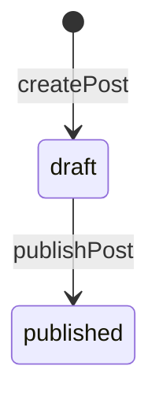

## What we're building

A default `status: PUBLISHED` filter on the `posts` query when no `status` argument is passed, plus a new `apps/api/src/auth/optional-gql-auth.guard.ts` (`OptionalGqlAuthGuard`) that lets `posts` read `@CurrentUser()` without rejecting anonymous callers — so an authenticated author or admin can still explicitly ask for `status: DRAFT` and see the drafts they're allowed to see. `PostsResolver.posts` and `PostsService.findPage` both change; `publishPost`, already built in [Posts resolver](/devblog/en/graphql-api/posts-resolver/), doesn't — this lesson is where its effect finally becomes visible end to end.

## Why

[Posts resolver](/devblog/en/graphql-api/posts-resolver/)'s own Verify section already demonstrated a real problem, without naming it as one: querying `posts` with no `Authorization` header at all returned `{ "title": "Hello, DevBlog", "status": "DRAFT" }`. That's not a bug in the code written so far — `findPage`'s `if (status) { filter.status = status; }` does exactly what it was told to — it's a gap in what the *default* was allowed to be. Omitting `status` was supposed to mean "an admin listing, every status," but the public `posts` query and the future admin dashboard's `posts` query are the same GraphQL operation with no way to tell them apart. Every anonymous reader has effectively had admin-listing behavior for free since Module 5.

The fix has two parts, because they answer two different questions. First: what does "no `status` argument" mean by default? From this lesson on, it means `PUBLISHED` — the safe, public-facing default any caller gets unless they ask for something else. Second: who's allowed to ask for something else? `status: DRAFT` needs a real caller behind it, because a draft is exactly the content an author isn't ready to show anyone yet. `GqlAuthGuard` isn't the right tool here — it throws when there's no valid token, and `posts` still needs to work with zero authentication for the common case (`status: PUBLISHED`, explicit or defaulted). `OptionalGqlAuthGuard` is the answer: it extends `AuthGuard('jwt')` the same way `GqlAuthGuard` does, but overrides `handleRequest` to never throw — an invalid, expired, or missing token just means `req.user` ends up `false`, the same falsy value `passport-jwt` already produces internally on failure, instead of an exception. `@CurrentUser()` reads that back exactly like it reads a real payload, so `posts` can ask "who, if anyone, is calling?" without ever refusing to answer.

`publishPost` itself needed no changes — [Posts resolver](/devblog/en/graphql-api/posts-resolver/) already wrote `PostsService.publish` to set `status: PostStatus.PUBLISHED` and `publishedAt: new Date()` in one `findByIdAndUpdate`. What was missing was a query that actually treated `draft` and `published` differently by default; now that it does, `publishedAt`'s purpose from [Schemas](/devblog/en/data-modeling/schemas/) — "set only when a post transitions to `status: 'published'`" — has a real audience: the moment `publishPost` runs, the exact same post that was invisible to a signed-out `posts` query a second earlier becomes visible, with no other write.



The whole lifecycle is a two-state machine with one legal transition. `createPost` is the only way to enter `draft`, and `publishPost` is the only way to leave it. There is currently no path back to `draft` (no "unpublish"), no third state (no "archived" or "scheduled"), and no transition that skips `draft` entirely (there's no `createAndPublishPost`). That's a deliberate scope limit worth naming explicitly, not an oversight — the same way [Posts resolver](/devblog/en/graphql-api/posts-resolver/) named DataLoader as a real gap it wasn't solving in this course. Adding "archived" or "scheduled for future publish" later would mean widening this diagram, not just adding a query filter.

## Pros & cons

**A `status` field on one `Post` collection vs. two separate collections (`drafts`, `posts`).** A single collection with a `status` enum, indexed (`Post.status` already carries `index: true` from [Schemas](/devblog/en/data-modeling/schemas/)), means `publishPost` is one in-place `findByIdAndUpdate` — the document's `_id`, `slug`, `author`, `tags`, and every relationship pointing at it (a `Comment.post` reference, once [Comments](/devblog/en/comments/) exists) stay completely untouched by a status change. Two physically separate collections would make "publish" a genuine move — delete from `drafts`, insert into `posts` — which either mints a new `_id` (breaking anything that already referenced the draft by id) or requires carefully preserving the old one across collections, plus a transaction so a crash mid-move can't leave a post in neither collection or in both. The single-collection design pays for that simplicity with every read needing an explicit status filter to avoid leaking drafts — exactly the gap this lesson just closed. Two collections would make "can a reader see this" a matter of *which collection you query*, structurally impossible to get wrong the way a forgotten filter is — at the cost of a real, transactional migration on every publish. For a single-author-ish blog where posts publish far more often than they're queried by status, DevBlog takes the cheap-write, careful-read side of that trade.

## Set it up

Create `apps/api/src/auth/optional-gql-auth.guard.ts`:

```ts
import { ExecutionContext, Injectable } from '@nestjs/common';
import { AuthGuard } from '@nestjs/passport';
import { GqlExecutionContext } from '@nestjs/graphql';

@Injectable()
export class OptionalGqlAuthGuard extends AuthGuard('jwt') {
  getRequest(context: ExecutionContext) {
    const ctx = GqlExecutionContext.create(context);
    return ctx.getContext().req;
  }

  handleRequest(err: unknown, user: unknown) {
    // Never throw here: a missing, invalid, or expired token means an
    // anonymous caller, not a rejected request. `req.user` ends up `false`
    // — the same falsy value passport-jwt already produces on failure —
    // and @CurrentUser() reads that back exactly like a real payload.
    return user;
  }
}
```

Update `apps/api/src/posts/posts.service.ts` — `FindPostsPageOptions` gains `authorFilter`, and `findPage` applies it alongside `status`/`tag`:

```ts
export interface FindPostsPageOptions {
  status?: PostStatus;
  tag?: string;
  page?: number;
  pageSize?: number;
  authorFilter?: string;
}
```

```ts
async findPage(options: FindPostsPageOptions = {}): Promise<PostsPageResult> {
  const { status, tag, page = 1, pageSize = 10, authorFilter } = options;
  const filter: Record<string, unknown> = {};
  if (status) {
    filter.status = status;
  }
  if (authorFilter) {
    filter.author = authorFilter;
  }
  if (tag) {
    filter.tags = tag;
  }

  const skip = (page - 1) * pageSize;
  const [items, total] = await Promise.all([
    this.postModel.find(filter).sort({ createdAt: -1 }).skip(skip).limit(pageSize).exec(),
    this.postModel.countDocuments(filter).exec(),
  ]);

  return { items, total, page, pageSize };
}
```

Update `apps/api/src/posts/posts.resolver.ts` — `posts` now guards with `OptionalGqlAuthGuard`, reads `@CurrentUser()`, and decides the default status and the author filter:

```ts
import { ForbiddenException, NotFoundException, UseGuards } from '@nestjs/common';
import { Args, ID, Int, Mutation, Parent, Query, ResolveField, Resolver } from '@nestjs/graphql';
import { PostsService, PostsPageResult } from './posts.service';
import { UsersService } from '../users/users.service';
import { Post } from './models/post.model';
import { PostPage } from './models/post-page.model';
import { PostStatus } from './enums/post-status.enum';
import { CreatePostInput } from './dto/create-post.input';
import { UpdatePostInput } from './dto/update-post.input';
import { User } from '../users/models/user.model';
import { PostDocument } from './schemas/post.schema';
import { GqlAuthGuard } from '../auth/gql-auth.guard';
import { OptionalGqlAuthGuard } from '../auth/optional-gql-auth.guard';
import { RolesGuard } from '../auth/roles.guard';
import { Roles } from '../auth/roles.decorator';
import { CurrentUser } from '../auth/current-user.decorator';

interface AuthenticatedUser {
  userId: string;
  email: string;
  role: 'author' | 'admin';
}

@Resolver(() => Post)
export class PostsResolver {
  constructor(
    private readonly postsService: PostsService,
    private readonly usersService: UsersService,
  ) {}

  @Query(() => PostPage)
  @UseGuards(OptionalGqlAuthGuard)
  posts(
    @Args('status', { type: () => PostStatus, nullable: true }) status?: PostStatus,
    @Args('tag', { type: () => String, nullable: true }) tag?: string,
    @Args('page', { type: () => Int, nullable: true }) page?: number,
    @Args('pageSize', { type: () => Int, nullable: true }) pageSize?: number,
    @CurrentUser() currentUser?: AuthenticatedUser,
  ): Promise<PostsPageResult> {
    let effectiveStatus = status;
    let authorFilter: string | undefined;

    if (status === PostStatus.DRAFT) {
      if (!currentUser) {
        throw new ForbiddenException('Sign in to view drafts');
      }
      if (currentUser.role !== 'admin') {
        authorFilter = currentUser.userId;
      }
    } else if (!status) {
      effectiveStatus = PostStatus.PUBLISHED;
    }

    return this.postsService.findPage({ status: effectiveStatus, tag, page, pageSize, authorFilter });
  }

  @Query(() => Post, { nullable: true })
  post(@Args('slug', { type: () => String }) slug: string): Promise<PostDocument | null> {
    return this.postsService.findBySlug(slug);
  }

  @Mutation(() => Post)
  @UseGuards(GqlAuthGuard)
  createPost(
    @Args('input') input: CreatePostInput,
    @CurrentUser() currentUser: AuthenticatedUser,
  ): Promise<PostDocument> {
    return this.postsService.create(currentUser.userId, input);
  }

  @Mutation(() => Post)
  @UseGuards(GqlAuthGuard)
  updatePost(
    @Args('id', { type: () => ID }) id: string,
    @Args('input') input: UpdatePostInput,
  ): Promise<PostDocument> {
    return this.postsService.update(id, input);
  }

  @Mutation(() => Post)
  @UseGuards(GqlAuthGuard)
  publishPost(@Args('id', { type: () => ID }) id: string): Promise<PostDocument> {
    return this.postsService.publish(id);
  }

  @Mutation(() => Post)
  @UseGuards(GqlAuthGuard, RolesGuard)
  @Roles('admin')
  deletePost(@Args('id', { type: () => ID }) id: string): Promise<PostDocument> {
    return this.postsService.remove(id);
  }

  @ResolveField(() => User)
  async author(@Parent() post: PostDocument): Promise<User> {
    const author = await this.usersService.findById(post.author.toString());
    if (!author) {
      throw new NotFoundException('Author not found');
    }
    return {
      id: author.id,
      email: author.email,
      displayName: author.displayName,
      role: author.role,
    };
  }
}
```

- **`OptionalGqlAuthGuard` on `posts`, not `GqlAuthGuard`** — the same class hierarchy [Guards & roles](/devblog/en/auth/guards-roles/) built `GqlAuthGuard` from, minus the one behavior (`handleRequest` throwing) that would make an unauthenticated `posts` call fail. `post`, `createPost`, `updatePost`, `publishPost`, and `deletePost` are all unchanged from [Posts resolver](/devblog/en/graphql-api/posts-resolver/).
- **`status === PostStatus.DRAFT`** is the only branch that touches `currentUser` at all — asking for `PUBLISHED` explicitly, or leaving `status` out entirely, never looks at who's calling, which is exactly why `posts` can stay reachable with zero authentication for the common case.
- **`currentUser.role !== 'admin'` sets `authorFilter`, an admin skips it** — an author asking for `status: DRAFT` only ever sees their own unpublished work; an admin asking for the same thing sees everyone's, matching the read-vs-moderate distinction [Posts resolver](/devblog/en/graphql-api/posts-resolver/)'s Pros & cons already drew between `author` and `admin`.
- This method now holds real access-control decisions directly in the resolver — worth noticing now, because [Refactoring pass](/devblog/en/content-workflow/refactoring-pass/) is where that gets named as exactly the kind of logic a resolver shouldn't be the one holding.

## Verify

```bash
npm run start:dev
```

With no `Authorization` header at all, run:

```graphql
query PublicPostsDefault {
  posts {
    total
    items {
      title
      status
    }
  }
}
```

```txt
{
  "data": {
    "posts": {
      "total": 0,
      "items": []
    }
  }
}
```

Every post created in earlier modules' Verify sections is still a `draft` — none of them were ever published — so the default-`PUBLISHED` filter now correctly returns nothing, where [Posts resolver](/devblog/en/graphql-api/posts-resolver/)'s own Verify section once returned one. With the same author's `Authorization` header from `createPost`, publish one of those posts:

```graphql
mutation PublishIt {
  publishPost(id: "<a post id from an earlier module>") {
    status
    publishedAt
  }
}
```

```txt
{
  "data": {
    "publishPost": {
      "status": "PUBLISHED",
      "publishedAt": "2026-07-13T10:15:00.000Z"
    }
  }
}
```

Run `PublicPostsDefault` again, still with no `Authorization` header, and that post now appears — `total: 1`, `status: "PUBLISHED"` — the same query, the same missing token, a different result, because the one write that changed was `publishPost`. Finally, confirm the draft guard itself: run `posts(status: DRAFT)` with no `Authorization` header and it fails with a `403`; run it again with a valid author token and it returns only that author's own remaining drafts, never another author's.

## Recap

`posts` now defaults to `status: PUBLISHED` whenever a caller doesn't say otherwise — closing a real gap where an unauthenticated reader could already see every draft, demonstrated by [Posts resolver](/devblog/en/graphql-api/posts-resolver/)'s own earlier Verify output. `OptionalGqlAuthGuard` makes that possible without blocking the common, anonymous case: it reads `@CurrentUser()` when a valid token is present and quietly resolves to no user otherwise, instead of `GqlAuthGuard`'s all-or-nothing rejection. `status: DRAFT` is now gated — an author sees only their own, an admin sees everyone's — and `publishPost`, unchanged since Module 5, finally has a query that treats its effect as real. The state machine is deliberately small: `draft → published`, one transition, no way back, which is exactly enough for what DevBlog needs right now.

Next: [Refactoring pass →](/devblog/en/content-workflow/refactoring-pass/)
