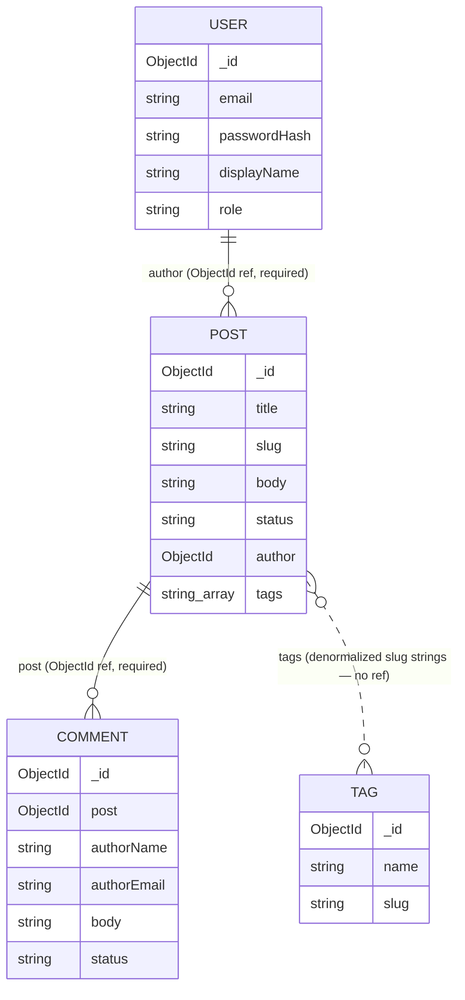

## What we're building

Four Mongoose schemas — `User`, `Post`, `Tag`, `Comment` — one class per file under `apps/api/src/<feature>/schemas/`, using the `@nestjs/mongoose` decorator style. These four collections are every piece of persistent state DevBlog has; every later module (auth, GraphQL resolvers, comments, admin) reads or writes through the models built from these schemas.



The two solid relationships (`author`, `post`) are real references, resolved with `populate`. The dotted `Post`–`Tag` line is not a database relationship at all — `Post.tags` stores tag slugs directly as strings, with no foreign key back to the `Tag` collection. [Relationships & indexes](/devblog/en/data-modeling/relationships-indexes/) covers why.

## Why

Every collection needs a schema before anything else in the course can compile: resolvers need a return type, DTOs need a shape to validate against, and Mongoose itself needs a schema to build a queryable model. Writing all four now, together, also makes the relationships between them explicit in one place — you can see that `Comment.post` and `Post.author` are the only two real references before you write a single resolver.

The `@nestjs/mongoose` package layers two decorators over plain Mongoose:

- **`@Schema()`** marks a class as a schema definition. `@Schema({ timestamps: true })` tells Mongoose to add and manage `createdAt`/`updatedAt` automatically — used on `User`, `Post`, and `Comment`, all of which need to know when a document was created or last touched. `Tag` has no `@Schema()` options because it's just a name/slug pair with no time-sensitive behavior.
- **`@Prop()`** marks a class property as a schema field. Its options object is the same shape as a plain Mongoose path definition (`required`, `unique`, `enum`, `default`, `index`, `type`, `ref`) — `@nestjs/mongoose` doesn't invent a new validation language, it just lets you declare it next to a typed class property instead of in a separate plain object.

`SchemaFactory.createForClass(User)` reads that decorator metadata off the `User` class and builds an actual `mongoose.Schema` instance — the same kind of object you'd get from `new mongoose.Schema({...})` by hand. The exported `UserSchema` is what gets registered with a model name via `MongooseModule.forFeature()` in [Backend Foundations](/devblog/en/backend-foundations/), which is where `@InjectModel(User.name)` starts returning a working Mongoose `Model<UserDocument>`.

`HydratedDocument<User>` is a separate, deliberate type from `User` itself. `User` describes the *shape* of the data — what a resolver returns, what a DTO validates against. `UserDocument = HydratedDocument<User>` describes a *live Mongoose document* — it adds `_id`, `save()`, `populate()`, and every other instance method Mongoose attaches at runtime. Service code that calls `this.userModel.findOne(...)` gets back a `UserDocument`; a GraphQL resolver returning data to a client works with the plain `User` shape.

## Pros & cons

**Document model (MongoDB) vs. relational (PostgreSQL).** A blog post is naturally one document: title, slug, Markdown body, a handful of scalar fields, and a small tags array — reading or writing "a post" reads or writes one document, with no join. Fields can be added (`excerpt`, `coverImage`) without a migration, which matters for a schema that's still settling in early modules. The cost is what you'd expect: MongoDB has no foreign-key constraint, so nothing stops `Post.author` from pointing at a deleted `User` — the application layer has to guard against that itself (or accept it, as [Relationships & indexes](/devblog/en/data-modeling/relationships-indexes/) discusses). Multi-collection joins (`populate`) are less efficient than a relational `JOIN` with matching indexes on both sides, and a transaction that touches both `Post` and `Comment` needs an explicit Mongoose session — it isn't implicit the way a single SQL transaction is.

For DevBlog specifically: every hot read path (render a post by slug, list published posts, list a post's approved comments) is answered by querying *one* collection with an index, not by joining several — which is exactly the case document databases are good at. TaskFlow, project #1 in this series, used PostgreSQL for the opposite reason: task/project/assignee data has real relational integrity requirements a task board depends on. DevBlog's content graph doesn't need that.

**Why `tags` is denormalized on `Post`, but `Comment` is a separate referenced collection.** These look like the same kind of "one-to-many" relationship, and they're modeled in opposite ways on purpose:

- **Tags are embedded (a `string[]` of slugs, directly on `Post`).** A post has at most a handful of tags, they rarely change independently of the post, and the two queries that need them — "render this post's tags" and "list posts tagged X" (`Post.find({ tags: slug })`) — both read `Post` directly. Embedding means rendering a post's tags never needs a `populate` call or a second round trip. The `Tag` collection still exists, but only for things that operate on tags as their own entity (an admin tag-management screen, slug uniqueness), not for anything on the read path.
- **Comments are referenced (their own collection, with a `post` field pointing back).** A popular post can accumulate an unbounded number of comments, comments have their own lifecycle independent of the post (submitted, then moderated to `approved` or `rejected`), and a post page almost never needs *all* of its comments loaded inline — it needs a paginated, status-filtered slice. Embedding an unbounded array inside `Post` would mean every comment add rewrites the whole post document, and every post read would either drag along every comment or need awkward array-slicing tricks. A separate collection, queried on demand and paginated independently, avoids both problems.

The rule of thumb: embed when the child data is small, bounded, and almost always read together with the parent; reference when the child data is unbounded, has its own lifecycle, or is usually read on its own.

## Set it up

Create `apps/api/src/users/schemas/user.schema.ts`:

```ts
import { Prop, Schema, SchemaFactory } from '@nestjs/mongoose';
import { HydratedDocument } from 'mongoose';

@Schema({ timestamps: true })
export class User {
  @Prop({ required: true, unique: true })
  email: string;

  @Prop({ required: true })
  passwordHash: string;

  @Prop({ required: true })
  displayName: string;

  @Prop({ required: true, enum: ['author', 'admin'], default: 'author' })
  role: 'author' | 'admin';
}

export type UserDocument = HydratedDocument<User>;
export const UserSchema = SchemaFactory.createForClass(User);
```

- **`email`** — required and unique. It's how an author signs in, so a duplicate account with the same email must be impossible; `unique: true` enforces that at the database level, not just in application code.
- **`passwordHash`** — never the raw password. [Authentication](/devblog/en/auth/) hashes it with bcrypt before it ever reaches this field.
- **`displayName`** — the public author name shown on published posts.
- **`role`** — `'author' | 'admin'`, defaulting to `'author'`. This is the field a later guard checks to gate admin-only actions like comment moderation and user management.

Create `apps/api/src/posts/schemas/post.schema.ts`:

```ts
import { Prop, Schema, SchemaFactory } from '@nestjs/mongoose';
import { HydratedDocument, Schema as MongooseSchema, Types } from 'mongoose';

@Schema({ timestamps: true })
export class Post {
  @Prop({ required: true })
  title: string;

  @Prop({ required: true, unique: true, index: true })
  slug: string;

  @Prop({ required: true })
  body: string;

  @Prop()
  excerpt?: string;

  @Prop()
  coverImage?: string;

  @Prop({ required: true, enum: ['draft', 'published'], default: 'draft', index: true })
  status: 'draft' | 'published';

  @Prop({ type: MongooseSchema.Types.ObjectId, ref: 'User', required: true })
  author: Types.ObjectId;

  @Prop({ type: [String], default: [] })
  tags: string[];

  @Prop()
  publishedAt?: Date;
}

export type PostDocument = HydratedDocument<Post>;
export const PostSchema = SchemaFactory.createForClass(Post);
```

- **`title`** — the human-readable heading, shown as-is.
- **`slug`** — required, unique, indexed. This is the primary lookup key for the public post page URL (`/posts/:slug`); uniqueness prevents two posts from colliding on the same URL, and the index is what makes that by-slug lookup fast instead of a collection scan.
- **`body`** — the raw Markdown source, rendered client-side by `react-markdown` in [Frontend Foundations](/devblog/en/frontend-foundations/).
- **`excerpt`** / **`coverImage`** — optional metadata for list views and social/SEO previews; not every post needs them, so they're not `required`.
- **`status`** — `'draft' | 'published'`, indexed. The public API only ever queries `status: 'published'`; the admin dashboard queries both. That single field is filtered on constantly, which is exactly what an index is for.
- **`author`** — a required `ObjectId` reference to `User`, not an embedded copy of the author's data. A `User` is its own entity with its own auth lifecycle, independent of any one post — embedding a snapshot of the author would go stale the moment a `displayName` changed.
- **`tags`** — a plain `string[]` of tag slugs, defaulting to `[]`. Denormalized on purpose — see Pros & cons above.
- **`publishedAt`** — optional, set only when a post transitions to `status: 'published'`. Used to sort and display the public feed, and to distinguish "created" from "went live."

Create `apps/api/src/tags/schemas/tag.schema.ts`:

```ts
import { Prop, Schema, SchemaFactory } from '@nestjs/mongoose';
import { HydratedDocument } from 'mongoose';

@Schema()
export class Tag {
  @Prop({ required: true, unique: true })
  name: string;

  @Prop({ required: true, unique: true })
  slug: string;
}

export type TagDocument = HydratedDocument<Tag>;
export const TagSchema = SchemaFactory.createForClass(Tag);
```

- **`name`** — the display form of the tag (e.g. `"Node.js"`).
- **`slug`** — the URL-safe form used everywhere else in the system, including as the raw strings stored in `Post.tags`. Both are unique — this collection is the canonical registry that keeps a tag's name and slug consistent, even though most reads never touch it directly.

Create `apps/api/src/comments/schemas/comment.schema.ts`:

```ts
import { Prop, Schema, SchemaFactory } from '@nestjs/mongoose';
import { HydratedDocument, Schema as MongooseSchema, Types } from 'mongoose';

@Schema({ timestamps: true })
export class Comment {
  @Prop({ type: MongooseSchema.Types.ObjectId, ref: 'Post', required: true, index: true })
  post: Types.ObjectId;

  @Prop({ required: true })
  authorName: string;

  @Prop({ required: true })
  authorEmail: string;

  @Prop({ required: true })
  body: string;

  @Prop({ required: true, enum: ['pending', 'approved', 'rejected'], default: 'pending', index: true })
  status: 'pending' | 'approved' | 'rejected';
}

export type CommentDocument = HydratedDocument<Comment>;
export const CommentSchema = SchemaFactory.createForClass(Comment);
```

- **`post`** — a required, indexed `ObjectId` reference to `Post`. Every comment belongs to exactly one post, and "comments for post X" is the single query pattern the whole comment thread depends on.
- **`authorName`** / **`authorEmail`** — plain text, captured at submission time. Public commenters are not authenticated `User` accounts in this course, so there's no `User` reference here — just the freeform identity the commenter typed in.
- **`body`** — the comment text.
- **`status`** — `'pending' | 'approved' | 'rejected'`, defaulting to `'pending'` and indexed. This is the moderation gate [Comments](/devblog/en/comments/) builds on: new comments start hidden, an admin approves or rejects them, and only `approved` ever reaches the public thread.

## Verify

Confirm all four files exist in the right place:

```bash
ls apps/api/src/*/schemas
```

```txt
apps/api/src/comments/schemas:
comment.schema.ts

apps/api/src/posts/schemas:
post.schema.ts

apps/api/src/tags/schemas:
tag.schema.ts

apps/api/src/users/schemas:
user.schema.ts
```

Then type-check the project — decorator metadata errors and typos in `@Prop()` options show up here before you've wired anything else to these schemas:

```bash
cd apps/api
npx tsc --noEmit
```

A clean run prints nothing and exits `0`. If it complains about `experimentalDecorators` or `emitDecoratorMetadata`, check `apps/api/tsconfig.json` — the Nest CLI scaffold from [Backend init](/devblog/en/setup/backend-init/) enables both by default, which `@Schema()`/`@Prop()` require to read class metadata at runtime.

## Recap

Four schemas, one file per collection, all using the `@Schema()`/`@Prop()` decorator style and `SchemaFactory.createForClass()` to turn a typed class into a real Mongoose schema. `User`, `Post`, and `Comment` track `timestamps`; `Tag` doesn't need to. The document model fits DevBlog's actual read patterns — one collection per hot query, no joins on the critical path — at the cost of no foreign-key enforcement and less efficient cross-collection joins than SQL. `Post.tags` is denormalized (slugs stored directly, no `Tag` reference) because tags are small, bounded, and always read with the post; `Comment` is its own referenced collection because comments are unbounded and have an independent moderation lifecycle. The `author` and `post` reference fields, the four indexes declared above, and how `populate` resolves them are the subject of the next lesson.

Next: [Relationships & indexes →](/devblog/en/data-modeling/relationships-indexes/)
