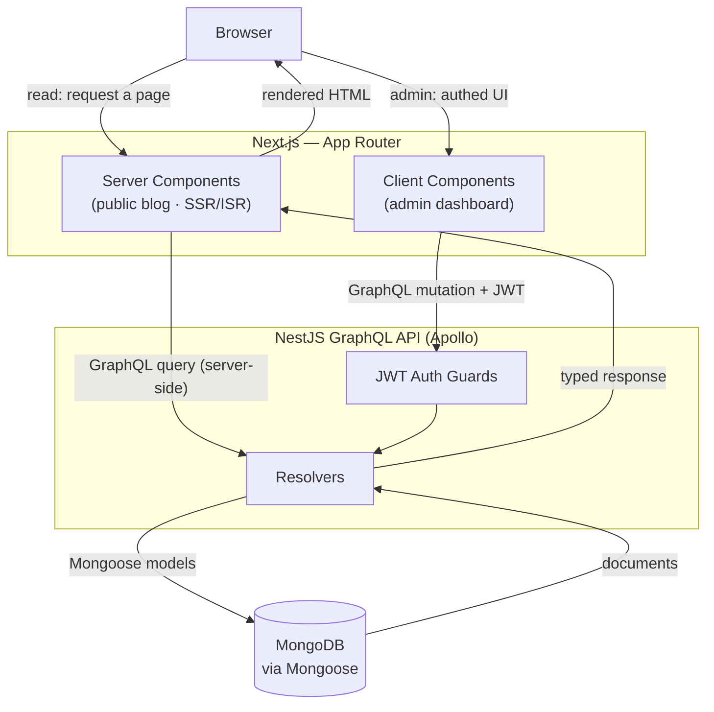

## What we're building

DevBlog is four layers with clear boundaries: the **browser**, a **Next.js App Router** front end, a **NestJS GraphQL API** served by Apollo, and a **MongoDB** database accessed through Mongoose. The diagram below shows how a request flows through them, and how the read path (a reader loading a post) differs from the write path (an author publishing or moderating from the admin).

## Why

Two very different kinds of traffic hit this system, and the design serves each one differently.

**The read path (public blog, ISR).** When a reader opens a post, the request lands on a **server component** in the Next.js App Router. That component fetches the post from the GraphQL API *on the server* and renders HTML. With **Incremental Static Regeneration (ISR)**, Next.js serves a cached, pre-rendered page instantly and quietly regenerates it in the background after a revalidation window — so readers get static-fast pages, but published edits still appear without a full rebuild. No credentials are involved: reading is public.

**The write/admin path (JWT-authed mutations).** When an author works in the admin dashboard, they are in **client components** that hold a session. Every publish, edit, tag, or moderation action is a **GraphQL mutation** carrying a **JWT** in its header. On the API, a Passport-JWT **guard** validates the token before the resolver runs. Only authenticated authors can mutate data; the resolver then persists the change through a Mongoose model. Because the read path uses ISR, a moderated comment or a freshly published post becomes visible to readers on the next revalidation.

## Why this stack

Every choice below is a trade-off, not a law. Here is the honest case for each.

**NestJS (vs plain Express).** Nest gives you modules, dependency injection, and a strong opinion about structure out of the box, which keeps a growing API navigable and testable. The cost is more ceremony and a steeper learning curve than a bare Express app — for a three-endpoint service that overhead would not pay off, but for a CMS with auth, content, and comments it does.

**MongoDB / document model (vs relational).** A blog post is naturally a document: title, body Markdown, an array of tags, author reference, timestamps. Storing it as one document maps cleanly to how it is read and written, and the schema can evolve without migrations. The trade-off is weaker support for complex cross-entity joins and relational integrity; comments-per-post and tag filtering are easy, but if DevBlog later needed heavy relational reporting, a SQL store would fit better.

**GraphQL (vs REST).** A single typed schema lets each front end ask for exactly the fields it needs — the public post page and the admin list fetch different shapes from the same graph without bespoke endpoints. The cost is added machinery (schema, resolvers, a client) and caching that is less trivial than HTTP caching on REST URLs. For two clients sharing one evolving model, the typed contract earns its keep.

**Next.js App Router + ISR (vs SPA or pure SSG).** A pure SPA would render everything client-side — bad for blog SEO and slower first paint. Pure SSG would be fast but require a rebuild for every content change. The App Router with ISR sits in between: server-rendered, cacheable, SEO-friendly pages that still update on a revalidation window without redeploying. The cost is a more involved rendering model — server vs client components, revalidation semantics — than a plain SPA.

**Markdown content (vs a WYSIWYG / rich-text store).** Storing raw Markdown keeps content portable, diffable, and simple to render, and it keeps authors close to plain text. The trade-off is a less visual editing experience than a rich-text WYSIWYG, and you own the rendering and sanitising. For a developer-audience blog, Markdown is the right default.

## Verify

Trace both paths in your head before moving on:

- **Read:** Browser → server component → GraphQL query → resolver → Mongoose → MongoDB, then rendered HTML back to the browser, served static-fast via ISR.
- **Write:** Browser (admin client) → GraphQL mutation + JWT → auth guard → resolver → Mongoose → MongoDB, then visible to readers on the next revalidation.

If you can say which path needs a JWT (the write path) and which is cacheable (the read path), you understand the architecture.

## Recap

DevBlog layers a browser, a Next.js App Router front end, a NestJS + Apollo GraphQL API, and MongoDB via Mongoose. Reads flow through server components with ISR for static-fast, SEO-friendly public pages; writes flow through JWT-authed GraphQL mutations guarded on the API. The stack — NestJS, MongoDB, GraphQL, App Router + ISR, Markdown — is chosen for a continuously-updated, multi-client CMS, and each choice trades simplicity for structure where the content team benefits.

Next: [Prerequisites →](/devblog/en/introduction/prerequisites/)
