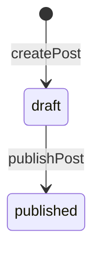

## What we're building

filter ค่าเริ่มต้น `status: PUBLISHED` บน query `posts` เมื่อไม่มีการส่ง argument `status` มา บวกกับไฟล์ใหม่ `apps/api/src/auth/optional-gql-auth.guard.ts` (`OptionalGqlAuthGuard`) ที่ให้ `posts` อ่าน `@CurrentUser()` ได้โดยไม่ปฏิเสธผู้เรียกที่ไม่ล็อกอิน — เพื่อให้ author หรือ admin ที่ล็อกอินแล้วยังขอ `status: DRAFT` แบบเจาะจงได้ และเห็น draft ที่ตัวเองมีสิทธิ์เห็น `PostsResolver.posts` และ `PostsService.findPage` เปลี่ยนทั้งคู่ ส่วน `publishPost` ที่สร้างไว้แล้วใน [Posts resolver](/devblog/th/graphql-api/posts-resolver/) ไม่ต้องเปลี่ยน — บทเรียนนี้คือจุดที่ผลของมันมองเห็นได้จริงตั้งแต่ต้นจนจบเสียที

## Why

Verify section ของ [Posts resolver](/devblog/th/graphql-api/posts-resolver/) เองก็เคยแสดงปัญหาจริงให้เห็นแล้ว เพียงแต่ไม่ได้เรียกมันว่าปัญหา: การ query `posts` โดยไม่มี header `Authorization` เลยคืนค่า `{ "title": "Hello, DevBlog", "status": "DRAFT" }` ออกมา นั่นไม่ใช่ bug ในโค้ดที่เขียนไปแล้ว — `if (status) { filter.status = status; }` ของ `findPage` ทำในสิ่งที่มันถูกสั่งให้ทำเป๊ะ — แต่มันคือช่องว่างในสิ่งที่ *ค่าเริ่มต้น* ควรจะเป็น การไม่ใส่ `status` ควรจะหมายถึง "listing แบบ admin ทุก status" แต่ query `posts` ฝั่งสาธารณะกับ query `posts` ของ admin dashboard ในอนาคตเป็น GraphQL operation เดียวกัน ไม่มีทางแยกออกจากกันได้เลย ผู้อ่านที่ไม่ล็อกอินทุกคนได้พฤติกรรมแบบ admin-listing ไปฟรี ๆ ตั้งแต่ Module 5

ทางแก้มีสองส่วน เพราะมันตอบคำถามคนละข้อกัน ข้อแรก: "ไม่มี argument `status`" ควรหมายถึงอะไรโดยค่าเริ่มต้น? ตั้งแต่บทเรียนนี้เป็นต้นไป มันหมายถึง `PUBLISHED` — ค่าเริ่มต้นที่ปลอดภัยสำหรับสาธารณะที่ผู้เรียกทุกคนได้ เว้นแต่จะขออย่างอื่น ข้อสอง: ใครมีสิทธิ์ขออย่างอื่นได้บ้าง? `status: DRAFT` ต้องมีผู้เรียกจริงอยู่เบื้องหลัง เพราะ draft คือเนื้อหาที่ author ยังไม่พร้อมจะให้ใครเห็นเลย `GqlAuthGuard` ไม่ใช่เครื่องมือที่ถูกต้องตรงนี้ — มัน throw เมื่อไม่มี token ที่ใช้ได้ ในขณะที่ `posts` ยังต้องทำงานได้โดยไม่มีการยืนยันตัวตนเลยสำหรับกรณีทั่วไป (`status: PUBLISHED` ไม่ว่าจะระบุเองหรือเป็นค่าเริ่มต้น) `OptionalGqlAuthGuard` คือคำตอบ: มัน extend `AuthGuard('jwt')` แบบเดียวกับที่ `GqlAuthGuard` ทำ แต่ override `handleRequest` ให้ไม่มีวัน throw — token ที่ไม่มี ไม่ถูกต้อง หรือหมดอายุ หมายความแค่ว่า `req.user` จะเป็น `false` ค่า falsy เดียวกับที่ `passport-jwt` ผลิตออกมาข้างในเมื่อล้มเหลวอยู่แล้ว แทนที่จะเป็น exception `@CurrentUser()` อ่านค่านั้นกลับมาเหมือนกับที่มันอ่าน payload จริงทุกประการ ทำให้ `posts` ถามได้ว่า "ใครกันแน่ที่กำลังเรียกอยู่ ถ้ามี" โดยไม่มีวันปฏิเสธที่จะตอบ

`publishPost` เองไม่ต้องเปลี่ยนอะไรเลย — [Posts resolver](/devblog/th/graphql-api/posts-resolver/) เขียน `PostsService.publish` ไว้แล้วให้ตั้ง `status: PostStatus.PUBLISHED` และ `publishedAt: new Date()` ใน `findByIdAndUpdate` ครั้งเดียว สิ่งที่ขาดไปคือ query ที่ปฏิบัติต่อ `draft` กับ `published` ต่างกันจริง ๆ โดยค่าเริ่มต้น ตอนนี้ที่มันทำแล้ว จุดประสงค์ของ `publishedAt` จาก [Schemas](/devblog/th/data-modeling/schemas/) — "ตั้งค่าก็ต่อเมื่อโพสต์เปลี่ยนไปเป็น `status: 'published'`" — มีผู้ชมจริงแล้ว: ทันทีที่ `publishPost` รัน โพสต์อันเดียวกันที่มองไม่เห็นจาก query `posts` แบบไม่ล็อกอินเมื่อวินาทีก่อนหน้า ก็กลายเป็นมองเห็นได้ โดยไม่มีการเขียนอื่นใดเลย



วงจรชีวิตทั้งหมดเป็น state machine สองสถานะที่มี transition ที่ถูกกฎหมายเพียงหนึ่งเดียว `createPost` เป็นทางเดียวที่จะเข้าสู่ `draft` และ `publishPost` เป็นทางเดียวที่จะออกจากมัน ตอนนี้ยังไม่มีทางกลับไปที่ `draft` (ไม่มี "unpublish") ไม่มีสถานะที่สาม (ไม่มี "archived" หรือ "scheduled") และไม่มี transition ที่ข้าม `draft` ไปเลย (ไม่มี `createAndPublishPost`) นี่คือขอบเขตที่จำกัดไว้โดยตั้งใจ คุ้มค่าที่จะเอ่ยถึงชัด ๆ ไม่ใช่การมองข้าม แบบเดียวกับที่ [Posts resolver](/devblog/th/graphql-api/posts-resolver/) เคยเรียก DataLoader ว่าเป็นช่องว่างจริงที่มันไม่ได้แก้ในคอร์สนี้ การเพิ่ม "archived" หรือ "กำหนดเวลาเผยแพร่ล่วงหน้า" ในภายหลังจะหมายถึงการขยาย diagram นี้ ไม่ใช่แค่เพิ่ม query filter

## Pros & cons

**field `status` บน `Post` collection เดียว เทียบกับสอง collection แยกกัน (`drafts`, `posts`)** collection เดียวที่มี `status` enum พร้อม index (`Post.status` มี `index: true` จาก [Schemas](/devblog/th/data-modeling/schemas/) อยู่แล้ว) หมายความว่า `publishPost` เป็นแค่ `findByIdAndUpdate` ในที่เดียวครั้งเดียว — `_id`, `slug`, `author`, `tags` ของ document และทุกความสัมพันธ์ที่ชี้มาที่มัน (reference `Comment.post` เมื่อ [Comments](/devblog/th/comments/) มีอยู่แล้ว) ไม่ถูกแตะต้องเลยจากการเปลี่ยน status สอง collection ที่แยกกันจริง ๆ จะทำให้ "publish" เป็นการย้ายจริง ๆ — ลบจาก `drafts` แล้ว insert เข้า `posts` — ซึ่งจะได้ `_id` ใหม่ (ทำลายอะไรก็ตามที่อ้างอิง draft ด้วย id เดิมไปแล้ว) หรือไม่ก็ต้องรักษา id เดิมข้าม collection อย่างระมัดระวัง บวก transaction เพื่อไม่ให้ crash กลางทางทิ้งโพสต์ไว้ไม่อยู่ใน collection ไหนเลยหรืออยู่ทั้งสองที่ การออกแบบ collection เดียวจ่ายค่าความเรียบง่ายนั้นด้วยการที่ทุกการอ่านต้องมี status filter ชัดเจนเพื่อไม่ให้ draft รั่วออกไป — ซึ่งเป็นช่องว่างเดียวกับที่บทเรียนนี้เพิ่งปิดไป สอง collection จะทำให้ "ผู้อ่านคนนี้เห็นสิ่งนี้ได้ไหม" กลายเป็นเรื่องของ *กำลัง query collection ไหนอยู่* ซึ่งผิดพลาดไม่ได้โดยโครงสร้างเลย ต่างจาก filter ที่ลืมใส่ — แลกกับ migration แบบ transaction จริงทุกครั้งที่ publish สำหรับบล็อกที่มักมีผู้เขียนคนเดียวซึ่ง publish บ่อยกว่าที่จะถูก query แยกตาม status มาก DevBlog เลือกฝั่งที่เขียนถูกกว่าแต่ต้องอ่านอย่างระมัดระวังของ trade-off นี้

## Set it up

สร้าง `apps/api/src/auth/optional-gql-auth.guard.ts`:

```ts
import { ExecutionContext, Injectable } from '@nestjs/common';
import { AuthGuard } from '@nestjs/passport';
import { GqlExecutionContext } from '@nestjs/graphql';

@Injectable()
export class OptionalGqlAuthGuard extends AuthGuard('jwt') {
  getRequest(context: ExecutionContext) {
    const ctx = GqlExecutionContext.create(context);
    return ctx.getContext().req;
  }

  handleRequest(err: unknown, user: unknown) {
    // Never throw here: a missing, invalid, or expired token means an
    // anonymous caller, not a rejected request. `req.user` ends up `false`
    // — the same falsy value passport-jwt already produces on failure —
    // and @CurrentUser() reads that back exactly like a real payload.
    return user;
  }
}
```

อัปเดต `apps/api/src/posts/posts.service.ts` — `FindPostsPageOptions` เพิ่ม `authorFilter` และ `findPage` นำมันไปใช้คู่กับ `status`/`tag`:

```ts
export interface FindPostsPageOptions {
  status?: PostStatus;
  tag?: string;
  page?: number;
  pageSize?: number;
  authorFilter?: string;
}
```

```ts
async findPage(options: FindPostsPageOptions = {}): Promise<PostsPageResult> {
  const { status, tag, page = 1, pageSize = 10, authorFilter } = options;
  const filter: Record<string, unknown> = {};
  if (status) {
    filter.status = status;
  }
  if (authorFilter) {
    filter.author = authorFilter;
  }
  if (tag) {
    filter.tags = tag;
  }

  const skip = (page - 1) * pageSize;
  const [items, total] = await Promise.all([
    this.postModel.find(filter).sort({ createdAt: -1 }).skip(skip).limit(pageSize).exec(),
    this.postModel.countDocuments(filter).exec(),
  ]);

  return { items, total, page, pageSize };
}
```

อัปเดต `apps/api/src/posts/posts.resolver.ts` — `posts` ตอนนี้ guard ด้วย `OptionalGqlAuthGuard`, อ่าน `@CurrentUser()`, และตัดสินใจทั้ง status ค่าเริ่มต้นและ author filter:

```ts
import { ForbiddenException, NotFoundException, UseGuards } from '@nestjs/common';
import { Args, ID, Int, Mutation, Parent, Query, ResolveField, Resolver } from '@nestjs/graphql';
import { PostsService, PostsPageResult } from './posts.service';
import { UsersService } from '../users/users.service';
import { Post } from './models/post.model';
import { PostPage } from './models/post-page.model';
import { PostStatus } from './enums/post-status.enum';
import { CreatePostInput } from './dto/create-post.input';
import { UpdatePostInput } from './dto/update-post.input';
import { User } from '../users/models/user.model';
import { PostDocument } from './schemas/post.schema';
import { GqlAuthGuard } from '../auth/gql-auth.guard';
import { OptionalGqlAuthGuard } from '../auth/optional-gql-auth.guard';
import { RolesGuard } from '../auth/roles.guard';
import { Roles } from '../auth/roles.decorator';
import { CurrentUser } from '../auth/current-user.decorator';

interface AuthenticatedUser {
  userId: string;
  email: string;
  role: 'author' | 'admin';
}

@Resolver(() => Post)
export class PostsResolver {
  constructor(
    private readonly postsService: PostsService,
    private readonly usersService: UsersService,
  ) {}

  @Query(() => PostPage)
  @UseGuards(OptionalGqlAuthGuard)
  posts(
    @Args('status', { type: () => PostStatus, nullable: true }) status?: PostStatus,
    @Args('tag', { type: () => String, nullable: true }) tag?: string,
    @Args('page', { type: () => Int, nullable: true }) page?: number,
    @Args('pageSize', { type: () => Int, nullable: true }) pageSize?: number,
    @CurrentUser() currentUser?: AuthenticatedUser,
  ): Promise<PostsPageResult> {
    let effectiveStatus = status;
    let authorFilter: string | undefined;

    if (status === PostStatus.DRAFT) {
      if (!currentUser) {
        throw new ForbiddenException('Sign in to view drafts');
      }
      if (currentUser.role !== 'admin') {
        authorFilter = currentUser.userId;
      }
    } else if (!status) {
      effectiveStatus = PostStatus.PUBLISHED;
    }

    return this.postsService.findPage({ status: effectiveStatus, tag, page, pageSize, authorFilter });
  }

  @Query(() => Post, { nullable: true })
  post(@Args('slug', { type: () => String }) slug: string): Promise<PostDocument | null> {
    return this.postsService.findBySlug(slug);
  }

  @Mutation(() => Post)
  @UseGuards(GqlAuthGuard)
  createPost(
    @Args('input') input: CreatePostInput,
    @CurrentUser() currentUser: AuthenticatedUser,
  ): Promise<PostDocument> {
    return this.postsService.create(currentUser.userId, input);
  }

  @Mutation(() => Post)
  @UseGuards(GqlAuthGuard)
  updatePost(
    @Args('id', { type: () => ID }) id: string,
    @Args('input') input: UpdatePostInput,
  ): Promise<PostDocument> {
    return this.postsService.update(id, input);
  }

  @Mutation(() => Post)
  @UseGuards(GqlAuthGuard)
  publishPost(@Args('id', { type: () => ID }) id: string): Promise<PostDocument> {
    return this.postsService.publish(id);
  }

  @Mutation(() => Post)
  @UseGuards(GqlAuthGuard, RolesGuard)
  @Roles('admin')
  deletePost(@Args('id', { type: () => ID }) id: string): Promise<PostDocument> {
    return this.postsService.remove(id);
  }

  @ResolveField(() => User)
  async author(@Parent() post: PostDocument): Promise<User> {
    const author = await this.usersService.findById(post.author.toString());
    if (!author) {
      throw new NotFoundException('Author not found');
    }
    return {
      id: author.id,
      email: author.email,
      displayName: author.displayName,
      role: author.role,
    };
  }
}
```

- **`OptionalGqlAuthGuard` บน `posts` แทนที่จะเป็น `GqlAuthGuard`** — class hierarchy เดียวกับที่ [Guards & roles](/devblog/th/auth/guards-roles/) สร้าง `GqlAuthGuard` ขึ้นมา ลบพฤติกรรมเดียว (`handleRequest` ที่ throw) ที่จะทำให้การเรียก `posts` แบบไม่ล็อกอินล้มเหลว `post`, `createPost`, `updatePost`, `publishPost` และ `deletePost` ทั้งหมดไม่เปลี่ยนแปลงจาก [Posts resolver](/devblog/th/graphql-api/posts-resolver/)
- **`status === PostStatus.DRAFT`** เป็น branch เดียวที่แตะ `currentUser` เลย — การขอ `PUBLISHED` แบบเจาะจง หรือไม่ใส่ `status` เลย ไม่มีการดูเลยว่าใครกำลังเรียกอยู่ นี่คือเหตุผลที่ `posts` ยังเข้าถึงได้โดยไม่ต้องยืนยันตัวตนเลยสำหรับกรณีทั่วไป
- **`currentUser.role !== 'admin'` ตั้ง `authorFilter`, admin ข้ามมันไป** — author ที่ขอ `status: DRAFT` เห็นแค่ผลงานที่ยังไม่เผยแพร่ของตัวเองเท่านั้น admin ที่ขอสิ่งเดียวกันเห็นของทุกคน ตรงกับความแตกต่างระหว่างการอ่าน-กับ-การกลั่นกรองที่ Pros & cons ของ [Posts resolver](/devblog/th/graphql-api/posts-resolver/) เคยขีดเส้นแบ่งไว้ระหว่าง `author` กับ `admin`
- method นี้ตอนนี้ถือการตัดสินใจด้าน access-control จริงไว้ในตัว resolver โดยตรง — คุ้มค่าที่จะสังเกตไว้ตั้งแต่ตอนนี้ เพราะ [Refactoring pass](/devblog/th/content-workflow/refactoring-pass/) คือจุดที่มันจะถูกเรียกชื่อว่าเป็นตรรกะประเภทที่ resolver ไม่ควรเป็นคนถืออยู่พอดี

## Verify

```bash
npm run start:dev
```

โดยไม่มี header `Authorization` เลย รัน:

```graphql
query PublicPostsDefault {
  posts {
    total
    items {
      title
      status
    }
  }
}
```

```txt
{
  "data": {
    "posts": {
      "total": 0,
      "items": []
    }
  }
}
```

โพสต์ทุกอันที่สร้างไว้ใน Verify section ของ module ก่อนหน้ายังคงเป็น `draft` อยู่ — ไม่มีอันไหนถูก publish เลย — ดังนั้น filter ค่าเริ่มต้น-`PUBLISHED` จึงคืนค่าว่างเปล่าถูกต้องแล้ว ต่างจาก Verify section ของ [Posts resolver](/devblog/th/graphql-api/posts-resolver/) เองที่เคยคืนมาหนึ่งอัน ใช้ header `Authorization` ของ author คนเดิมจาก `createPost` publish โพสต์อันหนึ่งในนั้น:

```graphql
mutation PublishIt {
  publishPost(id: "<a post id from an earlier module>") {
    status
    publishedAt
  }
}
```

```txt
{
  "data": {
    "publishPost": {
      "status": "PUBLISHED",
      "publishedAt": "2026-07-13T10:15:00.000Z"
    }
  }
}
```

รัน `PublicPostsDefault` อีกครั้ง ยังไม่มี header `Authorization` เหมือนเดิม แล้วโพสต์อันนั้นก็ปรากฏขึ้นมา — `total: 1`, `status: "PUBLISHED"` — query เดียวกัน token ที่หายไปเหมือนกัน แต่ผลลัพธ์ต่างกัน เพราะการเขียนอย่างเดียวที่เปลี่ยนไปคือ `publishPost` สุดท้าย ยืนยัน draft guard เอง: รัน `posts(status: DRAFT)` โดยไม่มี header `Authorization` แล้วมันจะล้มเหลวด้วย `403` รันอีกครั้งพร้อม token ของ author ที่ใช้ได้จริง แล้วมันจะคืนเฉพาะ draft ที่เหลือของ author คนนั้นเท่านั้น ไม่มีวันเป็นของ author คนอื่น

## Recap

`posts` ตอนนี้เป็นค่าเริ่มต้น `status: PUBLISHED` เมื่อผู้เรียกไม่ได้บอกเป็นอย่างอื่น — ปิดช่องว่างจริงที่ผู้อ่านที่ไม่ล็อกอินเคยเห็น draft ทุกอันได้ ตามที่ output ของ Verify section ก่อนหน้าของ [Posts resolver](/devblog/th/graphql-api/posts-resolver/) เองแสดงให้เห็นแล้ว `OptionalGqlAuthGuard` ทำให้เป็นไปได้โดยไม่บล็อกกรณีทั่วไปที่ไม่ล็อกอิน: มันอ่าน `@CurrentUser()` เมื่อมี token ที่ใช้ได้จริง และ resolve เป็นไม่มีผู้ใช้อย่างเงียบ ๆ ในกรณีอื่น แทนที่การปฏิเสธแบบทั้งหมดหรือไม่มีเลยของ `GqlAuthGuard` `status: DRAFT` ตอนนี้ถูกคุ้มกันแล้ว — author เห็นแค่ของตัวเอง admin เห็นของทุกคน — และ `publishPost` ที่ไม่เปลี่ยนแปลงตั้งแต่ Module 5 ในที่สุดก็มี query ที่ปฏิบัติต่อผลของมันอย่างจริงจัง state machine ถูกออกแบบให้เล็กโดยตั้งใจ: `draft → published` transition เดียว ไม่มีทางกลับ ซึ่งเพียงพอแล้วสำหรับสิ่งที่ DevBlog ต้องการตอนนี้

Next: [Refactoring pass →](/devblog/th/content-workflow/refactoring-pass/)
