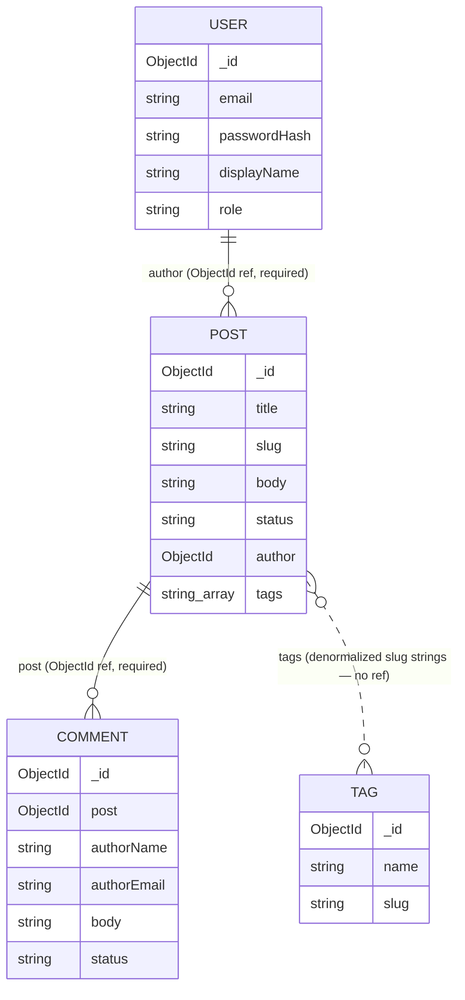

## What we're building

Mongoose schema สี่ตัว — `User`, `Post`, `Tag`, `Comment` — คลาสละหนึ่งไฟล์ ใต้ `apps/api/src/<feature>/schemas/` โดยใช้สไตล์ decorator ของ `@nestjs/mongoose` ทั้งสี่ collection นี้คือ persistent state ทั้งหมดของ DevBlog ทุกโมดูลถัดไป (auth, GraphQL resolvers, comments, admin) อ่านหรือเขียนผ่าน model ที่สร้างจาก schema เหล่านี้



ความสัมพันธ์เส้นทึบสองเส้น (`author`, `post`) คือ reference จริง ๆ ที่ resolve ด้วย `populate` ส่วนเส้นประระหว่าง `Post`–`Tag` ไม่ใช่ความสัมพันธ์ในระดับฐานข้อมูลเลย — `Post.tags` เก็บ tag slug เป็น string ตรง ๆ ไม่มี foreign key กลับไปที่ collection `Tag` [Relationships & indexes](/devblog/th/data-modeling/relationships-indexes/) จะอธิบายเหตุผล

## Why

ทุก collection ต้องมี schema ก่อนที่ส่วนอื่นของคอร์สจะ compile ได้: resolver ต้องการ return type, DTO ต้องการรูปร่างไว้ validate และ Mongoose เองก็ต้องการ schema เพื่อสร้าง model ที่ query ได้ การเขียนทั้งสี่ตัวพร้อมกันตอนนี้ยังทำให้ความสัมพันธ์ระหว่างกันชัดเจนอยู่ในที่เดียว — คุณจะเห็นว่า `Comment.post` และ `Post.author` เป็น reference จริงเพียงสองตัวเท่านั้น ก่อนที่จะเขียน resolver สักตัวเดียว

แพ็กเกจ `@nestjs/mongoose` เพิ่ม decorator สองตัวทับ Mongoose ธรรมดา:

- **`@Schema()`** ทำเครื่องหมายว่าคลาสนี้เป็น schema definition `@Schema({ timestamps: true })` บอก Mongoose ให้เพิ่มและจัดการ `createdAt`/`updatedAt` ให้อัตโนมัติ — ใช้กับ `User`, `Post`, และ `Comment` ซึ่งทั้งหมดต้องรู้ว่า document ถูกสร้างหรือแก้ไขล่าสุดเมื่อไหร่ `Tag` ไม่มี options ใน `@Schema()` เพราะมันเป็นแค่คู่ name/slug ที่ไม่มีพฤติกรรมที่อิงเวลา
- **`@Prop()`** ทำเครื่องหมายว่า property ของคลาสนี้เป็น field ใน schema object options ของมันมีรูปร่างเดียวกับ path definition ธรรมดาของ Mongoose (`required`, `unique`, `enum`, `default`, `index`, `type`, `ref`) — `@nestjs/mongoose` ไม่ได้คิดภาษา validation ใหม่ขึ้นมา แค่ให้คุณประกาศมันข้าง ๆ property ของคลาสที่มี type แทนที่จะเขียนใน plain object แยกต่างหาก

`SchemaFactory.createForClass(User)` อ่าน decorator metadata จากคลาส `User` แล้วสร้าง `mongoose.Schema` instance จริง ๆ ขึ้นมา — เป็น object ประเภทเดียวกับที่คุณจะได้จาก `new mongoose.Schema({...})` ด้วยมือ `UserSchema` ที่ export ออกมาคือสิ่งที่จะถูกลงทะเบียนพร้อม model name ผ่าน `MongooseModule.forFeature()` ใน [Backend Foundations](/devblog/th/backend-foundations/) ซึ่งเป็นจุดที่ `@InjectModel(User.name)` เริ่มคืนค่า Mongoose `Model<UserDocument>` ที่ใช้งานได้จริง

`HydratedDocument<User>` เป็น type ที่แยกจาก `User` เองโดยตั้งใจ `User` อธิบาย *รูปร่าง* ของข้อมูล — สิ่งที่ resolver คืนค่า, สิ่งที่ DTO validate เทียบด้วย ส่วน `UserDocument = HydratedDocument<User>` อธิบาย *document Mongoose ที่มีชีวิต* — มันเพิ่ม `_id`, `save()`, `populate()` และ instance method อื่น ๆ ที่ Mongoose ติดให้ตอน runtime โค้ด service ที่เรียก `this.userModel.findOne(...)` จะได้ `UserDocument` กลับมา ส่วน resolver ของ GraphQL ที่คืนข้อมูลให้ client ทำงานกับรูปร่าง `User` ธรรมดา

## Pros & cons

**Document model (MongoDB) เทียบกับ relational (PostgreSQL)** โพสต์บล็อกหนึ่งโพสต์โดยธรรมชาติคือ document เดียว: title, slug, Markdown body, field แบบ scalar ไม่กี่ตัว และ array tags เล็ก ๆ — การอ่านหรือเขียน "โพสต์หนึ่งโพสต์" คือการอ่านหรือเขียน document เดียว ไม่ต้อง join field ใหม่ ๆ (`excerpt`, `coverImage`) เพิ่มได้โดยไม่ต้อง migration ซึ่งสำคัญสำหรับ schema ที่ยังปรับตัวอยู่ในโมดูลต้น ๆ ต้นทุนก็ตามคาด: MongoDB ไม่มี foreign-key constraint ดังนั้นไม่มีอะไรกัน `Post.author` ไม่ให้ชี้ไปที่ `User` ที่ถูกลบไปแล้ว — application layer ต้องป้องกันเอง (หรือยอมรับมัน ตามที่ [Relationships & indexes](/devblog/th/data-modeling/relationships-indexes/) พูดถึง) การ join ข้าม collection (`populate`) มีประสิทธิภาพน้อยกว่า relational `JOIN` ที่มี index ตรงกันทั้งสองฝั่ง และ transaction ที่แตะทั้ง `Post` และ `Comment` ต้องใช้ Mongoose session แบบเจาะจง — มันไม่ใช่แบบ implicit เหมือน SQL transaction เดียว

สำหรับ DevBlog โดยเฉพาะ: ทุก hot read path (render โพสต์ตาม slug, list โพสต์ที่ published, list comment ที่ approved ของโพสต์) ตอบด้วยการ query collection *เดียว* พร้อม index ไม่ต้อง join หลายตัว — ซึ่งตรงกับสิ่งที่ document database ทำได้ดี TaskFlow โปรเจกต์ #1 ในซีรีส์นี้ใช้ PostgreSQL ด้วยเหตุผลตรงข้าม: ข้อมูล task/project/assignee มี requirement ด้าน relational integrity จริง ๆ ที่ task board พึ่งพา กราฟเนื้อหาของ DevBlog ไม่ต้องการแบบนั้น

**เหตุผลที่ `tags` denormalize อยู่บน `Post` แต่ `Comment` เป็น collection แยกที่ reference** สองอย่างนี้ดูเหมือนความสัมพันธ์แบบ "one-to-many" เดียวกัน แต่ถูก model ในทางตรงข้ามกันโดยตั้งใจ:

- **Tags ถูก embed (เป็น `string[]` ของ slug ตรง ๆ บน `Post`)** โพสต์หนึ่งมี tag ได้มากสุดไม่กี่ตัว ไม่ค่อยเปลี่ยนแยกจากตัวโพสต์ และ query สองตัวที่ต้องใช้มัน — "render tag ของโพสต์นี้" กับ "list โพสต์ที่ tag X" (`Post.find({ tags: slug })`) — ทั้งคู่อ่านจาก `Post` โดยตรง การ embed หมายความว่าการ render tag ของโพสต์ไม่ต้องเรียก `populate` หรือ round trip ที่สอง collection `Tag` ยังมีอยู่ แต่ใช้เฉพาะสิ่งที่ทำงานกับ tag ในฐานะ entity ของตัวเอง (หน้าจอ admin จัดการ tag, ความไม่ซ้ำของ slug) ไม่ใช่อะไรบน read path
- **Comments ถูก reference (collection ของตัวเอง พร้อม field `post` ชี้กลับ)** โพสต์ยอดนิยมสามารถสะสม comment ได้ไม่จำกัดจำนวน comment มี lifecycle ของตัวเองแยกจากโพสต์ (ส่งเข้ามา แล้วถูก moderate เป็น `approved` หรือ `rejected`) และหน้าโพสต์แทบไม่เคยต้องโหลด comment *ทั้งหมด* แบบ inline — มันต้องการ slice ที่ paginate และกรองตาม status การ embed array ที่ไม่จำกัดไว้ใน `Post` จะหมายความว่าทุกครั้งที่เพิ่ม comment ต้องเขียน document โพสต์ทั้งก้อนใหม่ และทุกการอ่านโพสต์จะต้องลาก comment ทุกตัวมาด้วย หรือไม่ก็ต้องใช้เทคนิค slice array ที่งุ่มง่าม collection แยกที่ query ตามต้องการและ paginate แยกกันหลีกเลี่ยงทั้งสองปัญหานี้

หลักคร่าว ๆ: embed เมื่อข้อมูลลูกเล็ก มีขอบเขตจำกัด และแทบจะถูกอ่านพร้อมกับ parent เสมอ; reference เมื่อข้อมูลลูกไม่จำกัด มี lifecycle ของตัวเอง หรือมักถูกอ่านเดี่ยว ๆ

## Set it up

สร้าง `apps/api/src/users/schemas/user.schema.ts`:

```ts
import { Prop, Schema, SchemaFactory } from '@nestjs/mongoose';
import { HydratedDocument } from 'mongoose';

@Schema({ timestamps: true })
export class User {
  @Prop({ required: true, unique: true })
  email: string;

  @Prop({ required: true })
  passwordHash: string;

  @Prop({ required: true })
  displayName: string;

  @Prop({ required: true, enum: ['author', 'admin'], default: 'author' })
  role: 'author' | 'admin';
}

export type UserDocument = HydratedDocument<User>;
export const UserSchema = SchemaFactory.createForClass(User);
```

- **`email`** — required และ unique มันคือสิ่งที่ author ใช้ login ดังนั้นบัญชีซ้ำที่ email เดียวกันต้องเป็นไปไม่ได้ `unique: true` บังคับสิ่งนี้ที่ระดับฐานข้อมูล ไม่ใช่แค่ใน application code
- **`passwordHash`** — ไม่ใช่รหัสผ่านดิบ ๆ [Authentication](/devblog/th/auth/) จะ hash มันด้วย bcrypt ก่อนถึง field นี้เสมอ
- **`displayName`** — ชื่อ author สาธารณะที่แสดงบนโพสต์ที่ publish แล้ว
- **`role`** — `'author' | 'admin'` ค่าเริ่มต้นคือ `'author'` นี่คือ field ที่ guard ในภายหลังจะเช็คเพื่อกั้น action ที่ admin เท่านั้นทำได้ เช่นการ moderate comment และจัดการ user

สร้าง `apps/api/src/posts/schemas/post.schema.ts`:

```ts
import { Prop, Schema, SchemaFactory } from '@nestjs/mongoose';
import { HydratedDocument, Schema as MongooseSchema, Types } from 'mongoose';

@Schema({ timestamps: true })
export class Post {
  @Prop({ required: true })
  title: string;

  @Prop({ required: true, unique: true, index: true })
  slug: string;

  @Prop({ required: true })
  body: string;

  @Prop()
  excerpt?: string;

  @Prop()
  coverImage?: string;

  @Prop({ required: true, enum: ['draft', 'published'], default: 'draft', index: true })
  status: 'draft' | 'published';

  @Prop({ type: MongooseSchema.Types.ObjectId, ref: 'User', required: true })
  author: Types.ObjectId;

  @Prop({ type: [String], default: [] })
  tags: string[];

  @Prop()
  publishedAt?: Date;
}

export type PostDocument = HydratedDocument<Post>;
export const PostSchema = SchemaFactory.createForClass(Post);
```

- **`title`** — หัวข้อที่มนุษย์อ่านได้ แสดงตามที่เป็น
- **`slug`** — required, unique, มี index นี่คือ lookup key หลักสำหรับ URL หน้าโพสต์สาธารณะ (`/posts/:slug`) ความไม่ซ้ำกันกันไม่ให้สองโพสต์ชน URL เดียวกัน และ index คือสิ่งที่ทำให้ lookup ตาม slug เร็วแทนที่จะ scan collection ทั้งหมด
- **`body`** — Markdown source ดิบ ๆ ที่ถูก render ฝั่ง client ด้วย `react-markdown` ใน [Frontend Foundations](/devblog/th/frontend-foundations/)
- **`excerpt`** / **`coverImage`** — metadata แบบ optional สำหรับหน้า list และ preview บน social/SEO ไม่ใช่ทุกโพสต์ที่ต้องมี จึงไม่ `required`
- **`status`** — `'draft' | 'published'` มี index public API จะ query แค่ `status: 'published'` เท่านั้น ส่วน admin dashboard query ทั้งสองค่า field นี้ถูกกรองตลอดเวลา ซึ่งตรงกับสิ่งที่ index มีไว้ทำ
- **`author`** — reference `ObjectId` แบบ required ไปที่ `User` ไม่ใช่สำเนาข้อมูล author ที่ embed ไว้ `User` เป็น entity ของตัวเองพร้อม auth lifecycle ของตัวเอง แยกจากโพสต์ใดโพสต์หนึ่ง — การ embed snapshot ของ author จะล้าสมัยทันทีที่ `displayName` เปลี่ยน
- **`tags`** — `string[]` ธรรมดาของ tag slug ค่าเริ่มต้นคือ `[]` denormalize ไว้โดยตั้งใจ — ดู Pros & cons ด้านบน
- **`publishedAt`** — optional ถูกตั้งค่าเฉพาะตอนโพสต์เปลี่ยนสถานะเป็น `status: 'published'` ใช้เรียงลำดับและแสดง public feed และแยกความต่างระหว่าง "สร้างแล้ว" กับ "publish แล้ว"

สร้าง `apps/api/src/tags/schemas/tag.schema.ts`:

```ts
import { Prop, Schema, SchemaFactory } from '@nestjs/mongoose';
import { HydratedDocument } from 'mongoose';

@Schema()
export class Tag {
  @Prop({ required: true, unique: true })
  name: string;

  @Prop({ required: true, unique: true })
  slug: string;
}

export type TagDocument = HydratedDocument<Tag>;
export const TagSchema = SchemaFactory.createForClass(Tag);
```

- **`name`** — รูปแบบที่แสดงของ tag (เช่น `"Node.js"`)
- **`slug`** — รูปแบบที่ปลอดภัยสำหรับ URL ที่ใช้ทั่วทั้งระบบ รวมถึงเป็น string ดิบที่เก็บอยู่ใน `Post.tags` ทั้งสอง field เป็น unique — collection นี้คือทะเบียนหลักที่รักษาความสอดคล้องระหว่าง name กับ slug ของ tag แม้ว่าการอ่านส่วนใหญ่จะไม่แตะมันโดยตรงเลยก็ตาม

สร้าง `apps/api/src/comments/schemas/comment.schema.ts`:

```ts
import { Prop, Schema, SchemaFactory } from '@nestjs/mongoose';
import { HydratedDocument, Schema as MongooseSchema, Types } from 'mongoose';

@Schema({ timestamps: true })
export class Comment {
  @Prop({ type: MongooseSchema.Types.ObjectId, ref: 'Post', required: true, index: true })
  post: Types.ObjectId;

  @Prop({ required: true })
  authorName: string;

  @Prop({ required: true })
  authorEmail: string;

  @Prop({ required: true })
  body: string;

  @Prop({ required: true, enum: ['pending', 'approved', 'rejected'], default: 'pending', index: true })
  status: 'pending' | 'approved' | 'rejected';
}

export type CommentDocument = HydratedDocument<Comment>;
export const CommentSchema = SchemaFactory.createForClass(Comment);
```

- **`post`** — reference `ObjectId` แบบ required และมี index ไปที่ `Post` comment ทุกตัวเป็นของโพสต์เดียวเท่านั้น และ "comment ของโพสต์ X" คือ query pattern เดียวที่ comment thread ทั้งหมดพึ่งพา
- **`authorName`** / **`authorEmail`** — plain text ที่บันทึกตอนส่ง commenter สาธารณะไม่ใช่บัญชี `User` ที่ authenticated ในคอร์สนี้ จึงไม่มี reference `User` ที่นี่ — มีแค่ตัวตนแบบ freeform ที่ commenter พิมพ์เข้ามา
- **`body`** — เนื้อหา comment
- **`status`** — `'pending' | 'approved' | 'rejected'` ค่าเริ่มต้นคือ `'pending'` และมี index นี่คือประตู moderation ที่ [Comments](/devblog/th/comments/) จะต่อยอด: comment ใหม่เริ่มต้นแบบซ่อนไว้ admin จะ approve หรือ reject มัน และมีแค่ `approved` เท่านั้นที่ไปถึง public thread

## Verify

ยืนยันว่าไฟล์ทั้งสี่อยู่ในตำแหน่งที่ถูกต้อง:

```bash
ls apps/api/src/*/schemas
```

```txt
apps/api/src/comments/schemas:
comment.schema.ts

apps/api/src/posts/schemas:
post.schema.ts

apps/api/src/tags/schemas:
tag.schema.ts

apps/api/src/users/schemas:
user.schema.ts
```

จากนั้น type-check โปรเจกต์ — error ของ decorator metadata และการพิมพ์ผิดใน options ของ `@Prop()` จะโผล่ออกมาตรงนี้ ก่อนที่คุณจะไปต่อสายอะไรอื่นเข้ากับ schema พวกนี้:

```bash
cd apps/api
npx tsc --noEmit
```

ถ้ารันสำเร็จจะไม่พิมพ์อะไรเลยและ exit `0` ถ้ามันบ่นเรื่อง `experimentalDecorators` หรือ `emitDecoratorMetadata` ให้เช็ค `apps/api/tsconfig.json` — Nest CLI scaffold จาก [Backend init](/devblog/th/setup/backend-init/) เปิดทั้งสองตัวไว้เป็นค่าเริ่มต้น ซึ่ง `@Schema()`/`@Prop()` ต้องใช้เพื่ออ่าน class metadata ตอน runtime

## Recap

Schema สี่ตัว ไฟล์ละหนึ่ง collection ทั้งหมดใช้สไตล์ decorator `@Schema()`/`@Prop()` และ `SchemaFactory.createForClass()` เพื่อแปลงคลาสที่มี type เป็น Mongoose schema จริง ๆ `User`, `Post`, และ `Comment` ติดตาม `timestamps`; `Tag` ไม่ต้องการ Document model เหมาะกับ read pattern จริงของ DevBlog — หนึ่ง collection ต่อหนึ่ง query ที่ hot ไม่ต้อง join บน critical path — แลกมาด้วยการไม่มี foreign-key enforcement และการ join ข้าม collection ที่มีประสิทธิภาพน้อยกว่า SQL `Post.tags` denormalize ไว้ (เก็บ slug ตรง ๆ ไม่มี reference `Tag`) เพราะ tag เล็ก มีขอบเขตจำกัด และถูกอ่านพร้อมโพสต์เสมอ; `Comment` เป็น collection ของตัวเองที่ reference เพราะ comment ไม่จำกัดจำนวนและมี moderation lifecycle ของตัวเอง field reference `author` กับ `post`, index สี่ตัวที่ประกาศไว้ด้านบน และวิธีที่ `populate` resolve พวกมันคือหัวข้อของบทเรียนถัดไป

ถัดไป: [Relationships & Indexes →](/devblog/th/data-modeling/relationships-indexes/)
