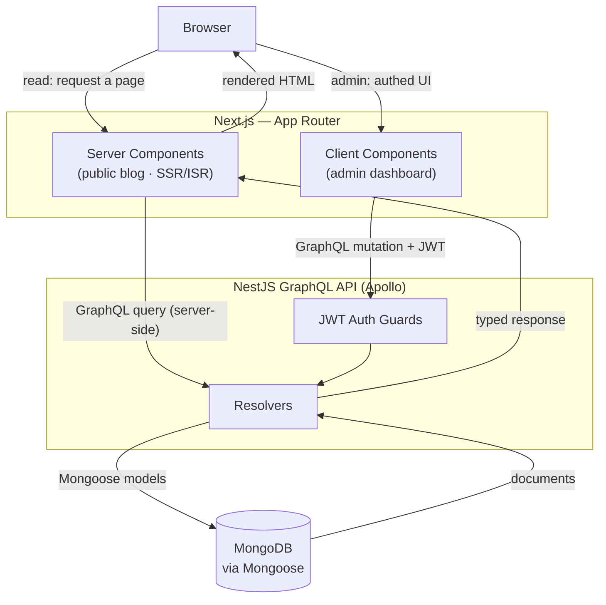

## What we're building

DevBlog มีสี่เลเยอร์ที่มีขอบเขตชัดเจน: **browser**, ฟรอนต์เอนด์ **Next.js App Router**, **NestJS GraphQL API** ที่ให้บริการโดย Apollo และฐานข้อมูล **MongoDB** ที่เข้าถึงผ่าน Mongoose ไดอะแกรมด้านล่างแสดงว่า request ไหลผ่านเลเยอร์เหล่านี้อย่างไร และเส้นทางอ่าน (ผู้อ่านเปิดโพสต์) ต่างจากเส้นทางเขียน (ผู้เขียนเผยแพร่หรือตรวจสอบจาก admin) อย่างไร

## Why

ทราฟฟิกสองแบบที่ต่างกันมากวิ่งเข้ามาที่ระบบนี้ และการออกแบบตอบสนองแต่ละแบบไม่เหมือนกัน

**เส้นทางอ่าน (บล็อกสาธารณะ, ISR)** เมื่อผู้อ่านเปิดโพสต์ request จะไปตกที่ **server component** ใน Next.js App Router คอมโพเนนต์นั้นดึงโพสต์จาก GraphQL API *บนเซิร์ฟเวอร์* แล้วเรนเดอร์ HTML ด้วย **Incremental Static Regeneration (ISR)** Next.js จะส่งหน้าที่แคชและเรนเดอร์ล่วงหน้าแบบทันที แล้วสร้างใหม่เงียบ ๆ อยู่เบื้องหลังหลังจากผ่านช่วง revalidation — ผู้อ่านจึงได้หน้าที่เร็วเท่า static แต่การแก้ไขที่เผยแพร่แล้วก็ยังปรากฏโดยไม่ต้อง build ใหม่ทั้งหมด ไม่มีการใช้ credential ใด ๆ เพราะการอ่านเป็นสาธารณะ

**เส้นทางเขียน/admin (mutation ที่ยืนยันด้วย JWT)** เมื่อผู้เขียนทำงานใน admin dashboard พวกเขาอยู่ใน **client component** ที่ถือ session ทุกการเผยแพร่ แก้ไข ใส่แท็ก หรือตรวจสอบ คือ **GraphQL mutation** ที่พก **JWT** ไว้ใน header ที่ฝั่ง API ตัว **guard** แบบ Passport-JWT จะตรวจสอบ token ก่อนที่ resolver จะทำงาน เฉพาะผู้เขียนที่ยืนยันตัวตนแล้วเท่านั้นที่ mutate ข้อมูลได้ จากนั้น resolver จะบันทึกการเปลี่ยนแปลงผ่านโมเดลของ Mongoose เพราะเส้นทางอ่านใช้ ISR คอมเมนต์ที่ตรวจสอบแล้วหรือโพสต์ที่เพิ่งเผยแพร่จะปรากฏต่อผู้อ่านในรอบ revalidation ถัดไป

## Why this stack

ทุกตัวเลือกด้านล่างเป็นการแลกเปลี่ยน (trade-off) ไม่ใช่กฎตายตัว นี่คือเหตุผลตรงไปตรงมาของแต่ละตัว

**NestJS (เทียบกับ Express ล้วน)** Nest ให้โมดูล dependency injection และแนวคิดเรื่องโครงสร้างที่ชัดเจนมาให้ทันที ซึ่งช่วยให้ API ที่โตขึ้นยังนำทางง่ายและเทสต์ได้ ต้นทุนคือพิธีการที่มากกว่าและเส้นโค้งการเรียนรู้ที่ชันกว่าแอป Express เปล่า ๆ — สำหรับเซอร์วิสสามเอนด์พอยต์ค่าโสหุ้ยนั้นไม่คุ้ม แต่สำหรับ CMS ที่มี auth เนื้อหา และคอมเมนต์ มันคุ้ม

**MongoDB / document model (เทียบกับ relational)** โพสต์บล็อกเป็นเอกสารโดยธรรมชาติ: ชื่อเรื่อง เนื้อหา Markdown อาร์เรย์ของแท็ก การอ้างอิงผู้เขียน timestamp การเก็บเป็นเอกสารเดียวแมปเข้ากับวิธีอ่านและเขียนอย่างสะอาด และ schema ปรับเปลี่ยนได้โดยไม่ต้องทำ migration สิ่งที่แลกคือการรองรับ join ข้ามเอนทิตีที่ซับซ้อนและความสมบูรณ์เชิงสัมพันธ์ที่อ่อนกว่า คอมเมนต์ต่อโพสต์และการกรองแท็กทำได้ง่าย แต่ถ้าภายหลัง DevBlog ต้องการรายงานเชิงสัมพันธ์หนัก ๆ ที่เก็บแบบ SQL จะเหมาะกว่า

**GraphQL (เทียบกับ REST)** schema เดียวที่มี type ทำให้ฟรอนต์เอนด์แต่ละตัวขอเฉพาะฟิลด์ที่ต้องการได้ — หน้าโพสต์สาธารณะกับรายการใน admin ดึงรูปร่างข้อมูลต่างกันจากกราฟเดียวกันโดยไม่ต้องมีเอนด์พอยต์เฉพาะ ต้นทุนคือกลไกที่เพิ่มขึ้น (schema, resolver, client) และการแคชที่ไม่ตรงไปตรงมาเท่าการแคช HTTP บน URL ของ REST สำหรับสองไคลเอนต์ที่ใช้โมเดลเดียวที่ปรับเปลี่ยนอยู่ตลอด สัญญาที่มี type คุ้มค่า

**Next.js App Router + ISR (เทียบกับ SPA หรือ SSG ล้วน)** SPA ล้วนจะเรนเดอร์ทุกอย่างฝั่งไคลเอนต์ — แย่ต่อ SEO ของบล็อกและ first paint ช้ากว่า SSG ล้วนจะเร็วแต่ต้อง build ใหม่ทุกครั้งที่เนื้อหาเปลี่ยน App Router พร้อม ISR อยู่ตรงกลาง: หน้าที่เรนเดอร์บนเซิร์ฟเวอร์ แคชได้ เป็นมิตรกับ SEO และยังอัปเดตในช่วง revalidation โดยไม่ต้อง redeploy ต้นทุนคือโมเดลการเรนเดอร์ที่ซับซ้อนกว่า — server กับ client component, ความหมายของ revalidation — เมื่อเทียบกับ SPA ธรรมดา

**เนื้อหา Markdown (เทียบกับ WYSIWYG / rich-text store)** การเก็บ Markdown ดิบทำให้เนื้อหาพกพาได้ diff ได้ และเรนเดอร์ง่าย และทำให้ผู้เขียนอยู่ใกล้ข้อความธรรมดา สิ่งที่แลกคือประสบการณ์แก้ไขที่ไม่เห็นภาพเท่า rich-text WYSIWYG และคุณต้องดูแลการเรนเดอร์และการ sanitise เอง สำหรับบล็อกที่กลุ่มเป้าหมายเป็นนักพัฒนา Markdown เป็นค่าเริ่มต้นที่ถูกต้อง

## Verify

ลองไล่ทั้งสองเส้นทางในหัวก่อนไปต่อ:

- **อ่าน:** Browser → server component → GraphQL query → resolver → Mongoose → MongoDB แล้วส่ง HTML ที่เรนเดอร์กลับไปที่ browser เร็วเท่า static ผ่าน ISR
- **เขียน:** Browser (admin client) → GraphQL mutation + JWT → auth guard → resolver → Mongoose → MongoDB แล้วปรากฏต่อผู้อ่านในรอบ revalidation ถัดไป

ถ้าคุณบอกได้ว่าเส้นทางไหนต้องใช้ JWT (เส้นทางเขียน) และเส้นทางไหนแคชได้ (เส้นทางอ่าน) แสดงว่าคุณเข้าใจสถาปัตยกรรมแล้ว

## Recap

DevBlog วางเลเยอร์ browser, ฟรอนต์เอนด์ Next.js App Router, NestJS + Apollo GraphQL API และ MongoDB ผ่าน Mongoose การอ่านไหลผ่าน server component พร้อม ISR เพื่อหน้าสาธารณะที่เร็วเท่า static และเป็นมิตรกับ SEO; การเขียนไหลผ่าน GraphQL mutation ที่ยืนยันด้วย JWT และมี guard คุมที่ฝั่ง API สแตกนี้ — NestJS, MongoDB, GraphQL, App Router + ISR, Markdown — ถูกเลือกสำหรับ CMS ที่อัปเดตต่อเนื่องและมีหลายไคลเอนต์ และแต่ละตัวเลือกแลกความเรียบง่ายกับโครงสร้างในจุดที่ทีมเนื้อหาได้ประโยชน์

ถัดไป: [Prerequisites →](/devblog/th/introduction/prerequisites/)
